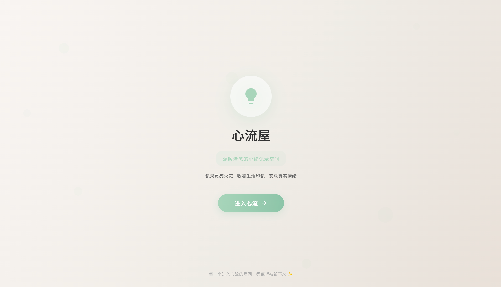
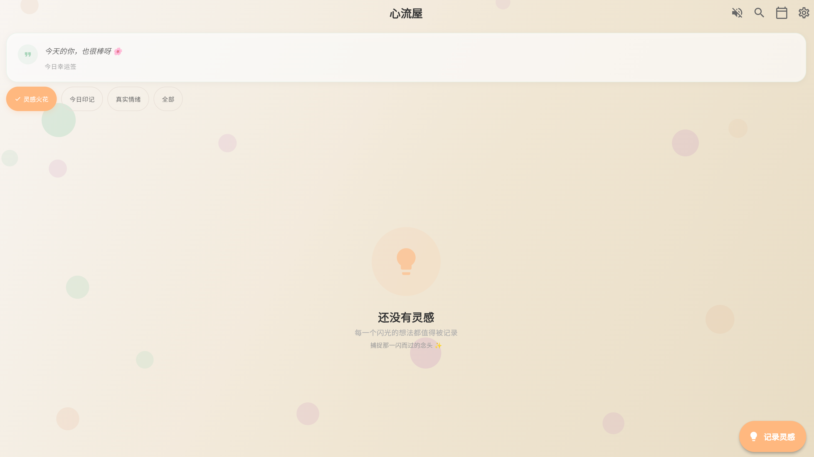
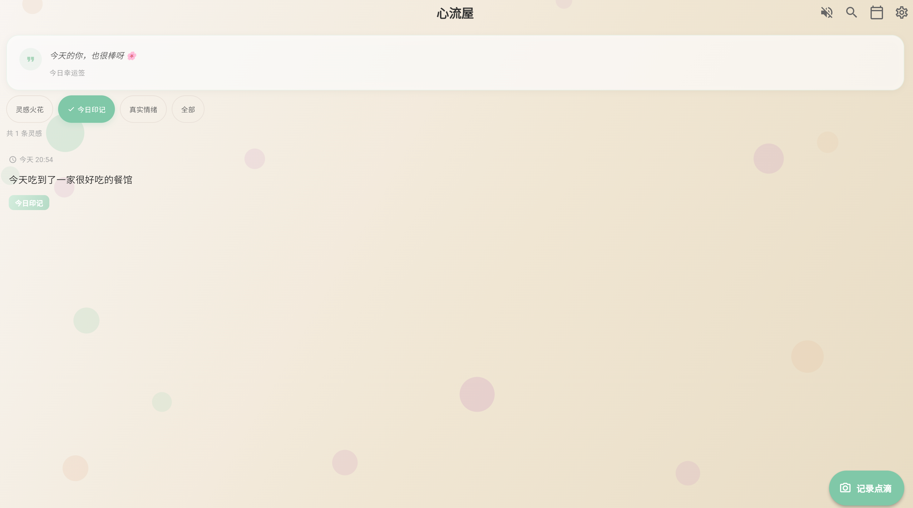
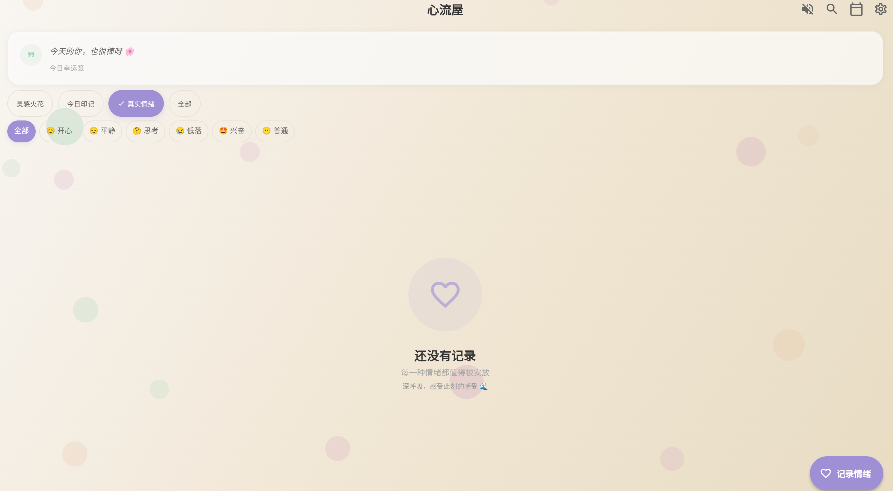
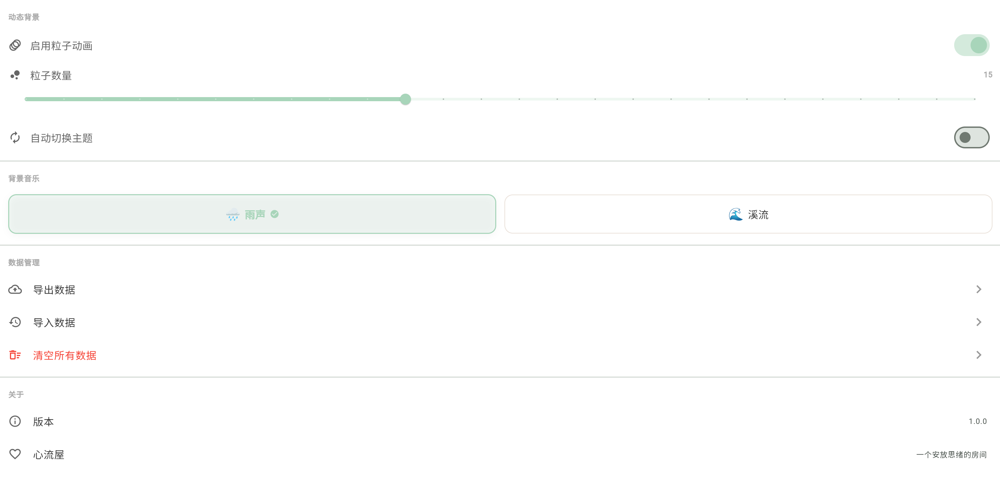
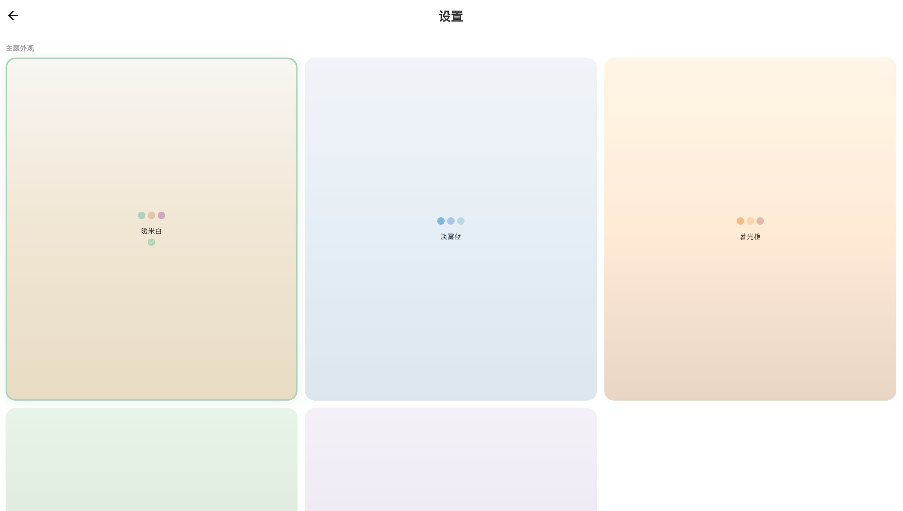
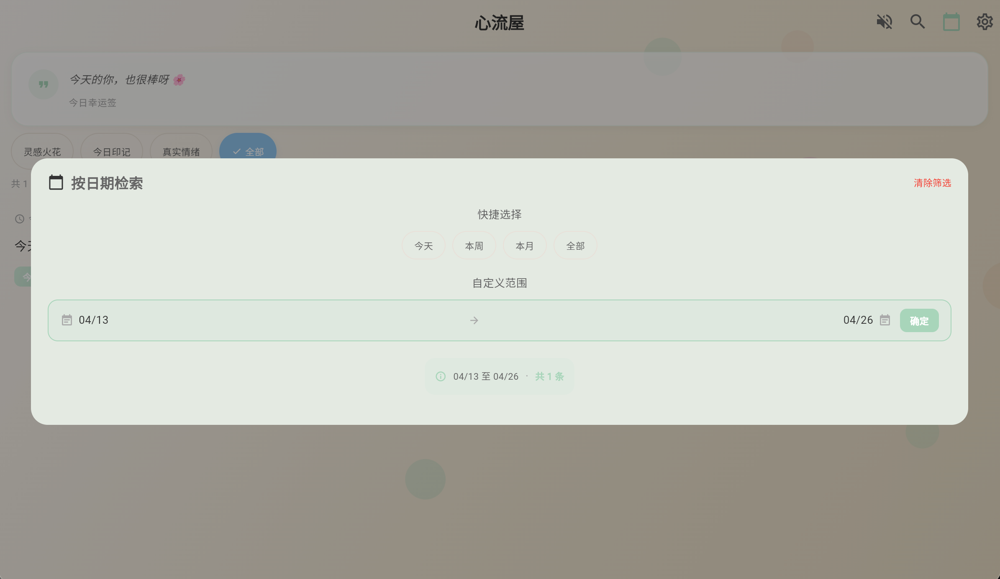

# 心流屋 | FlowHouse

一个温暖治愈的灵感与情绪记录应用，帮你捕捉每一个闪光的念头，安放每一种真实的情绪。

> 基于 Flutter 构建，当前支持 Web 平台。

## 在线体验

访问演示站点：[GitHub Pages](https://your-username.github.io/inspiration-app)暂未开通

## 功能特性

- **灵感记录** — 随时捕捉一闪而过的想法与创意
- **情绪记录** — 标注当下的心情，支持多维度情绪分类
- **分类管理** — 灵感火花 / 今日印记 / 真实情绪，三大类别清晰归整
- **标签系统** — 为灵感打上标签，快速检索与筛选
- **图片附件** — 为灵感配上图片，更完整地记录瞬间
- **全文搜索** — 一键搜索内容、标签，快速找回过去的记录
- **日期过滤** — 按今天 / 本周 / 本月 / 自定义范围筛选
- **多主题切换** — 5 套治愈系配色主题，可自动轮播
- **动态粒子背景** — 优雅的粒子动画，随主题变换色彩
- **白噪音播放** — 雨声、溪流等环境音，助你沉浸思考
- **治愈语录** — 每日灵感签，带来一丝温暖与启发
- **本地存储** — 基于 Hive 的无数据库方案，数据完全本地化

## 界面功能预览

首页开屏界面---心流屋简介

灵感火花界面---记录你的每一个想法

今日印记界面---记录生活中的小确幸

真实情绪界面---安放你的每一种情绪

设置界面

主题选择---莫兰迪色系

检索功能---可按日期检索

## 快速开始

### 环境要求

- Flutter 3.11+ / Dart 3.11+
- Chrome 浏览器（当前项目仅支持 Web 平台）
- 运行 `flutter doctor` 确认 Web 设备可用

### 安装与运行

```bash
# 克隆仓库
git clone https://github.com/your-username/inspiration-app.git
cd inspiration-app

# 安装依赖
flutter pub get

# 在 Chrome 中运行
flutter run -d chrome
```

### 构建 Web

```bash
flutter build web
```

构建产物位于 `build/web/`，可直接部署至 GitHub Pages、Vercel、Netlify 等平台。

### 本地预览

构建完成后，可启动本地 HTTP 服务器预览：

```bash
# 前台运行（Ctrl+C 停止）
python3 -m http.server 8080 --directory build/web

# 后台运行（关闭终端也继续）
nohup python3 -m http.server 8080 --directory build/web > /dev/null 2>&1 &

# 停止后台服务
lsof -ti:8080 | xargs kill -9
```

启动后访问 http://localhost:8080 即可预览。

## 部署到 GitHub Pages

### 方式一：手动部署

```bash
# 1. 构建 Web 产物（替换 your-username 为你的 GitHub 用户名）
flutter build web --base-href "/inspiration-app/"

# 2. 推送 build/web 到 gh-pages 分支
cd build/web
git init
git add .
git commit -m "Deploy"
git push -f git@github.com:your-username/inspiration-app.git HEAD:gh-pages
```

然后在仓库 Settings → Pages → Source 选择 `gh-pages` 分支。

### 方式二：自动部署（推荐）

创建 `.github/workflows/deploy.yml`：

```yaml
name: Deploy to GitHub Pages

on:
  push:
    branches: [ main ]

permissions:
  contents: read
  pages: write
  id-token: write

jobs:
  build:
    runs-on: ubuntu-latest
    steps:
      - uses: actions/checkout@v4
      - uses: subosito/flutter-action@v2
      - run: flutter pub get
      - run: flutter build web --release --base-href "/inspiration-app/"
      - uses: peaceiris/actions-gh-pages@v4
        with:
          github_token: ${{ secrets.GITHUB_TOKEN }}
          publish_dir: ./build/web
```

推送代码到 `main` 分支即可自动构建部署。

## 技术栈

| 领域 | 技术 |
|------|------|
| 框架 | Flutter 3.x + Material 3 |
| 状态管理 | Provider |
| 本地存储 | Hive (NoSQL) |
| 音频 | audioplayers + dart:js (Web) |
| 图片 | image_picker (Web 兼容) |
| 布局 | CustomScrollView + Sliver |
| 动画 | 自定义 Tween + PageRouteBuilder |

## 项目结构

```
lib/
├── main.dart                          # 应用入口 & 主题配置
├── models/
│   └── inspiration.dart               # 灵感数据模型
├── providers/
│   ├── inspiration_provider.dart      # 灵感状态管理（过滤/搜索/日期筛选）
│   └── theme_provider.dart            # 主题状态管理（自动切换/背景控制）
├── screens/
│   ├── home/                          # 首页：时间线 + 过滤 + 空状态
│   ├── editor/                        # 编辑器：情绪/内容/图片/标签
│   ├── detail/                        # 详情页：沉浸式全屏浏览
│   ├── settings/                      # 设置：主题/背景/白噪音/数据管理
│   ├── tags/                          # 标签管理
│   └── welcome/                       # 欢迎页：开屏动画
├── services/
│   └── hive_service.dart              # Hive 数据库封装
├── utils/
│   ├── constants.dart                 # 设计令牌：配色/字体/间距/动画
│   ├── page_transitions.dart          # 页面转场动画
│   └── platform_image.dart            # 跨平台图片组件
└── widgets/
    ├── healing_background.dart        # 粒子动画背景
    ├── inspiration_card.dart          # 灵感卡片组件
    ├── mood_selector.dart             # 心情选择器
    └── ...
```

## 主题系统

应用内置 5 套治愈系主题，每套主题包含独立的渐变色、粒子色彩和强调色：

- 🌿 自然微风
- 🌅 暮色温柔
- 🌊 深海宁静
- 🌸 樱花粉
- 🌙 月光蓝

支持自动轮播，可在设置中调整切换间隔。

## License

[MIT](LICENSE)

---

*Made with 💚*
